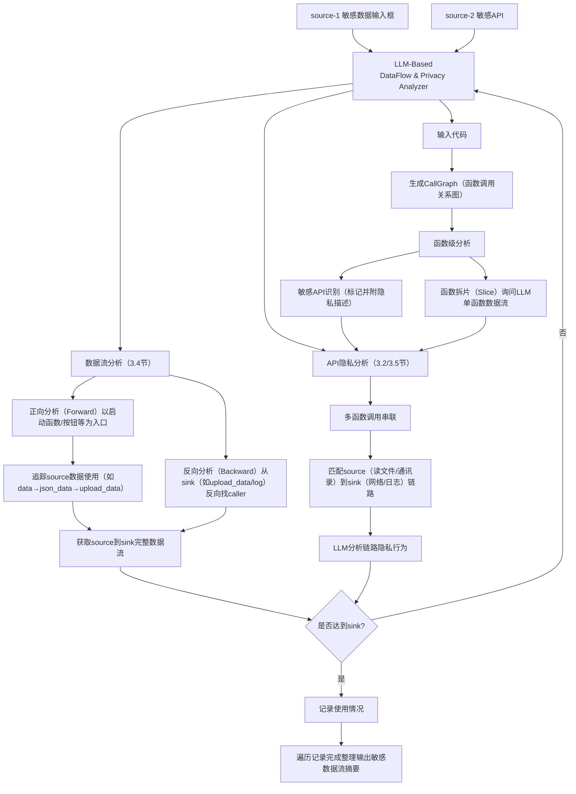

```mermaid
flowchart TD
    %% 左侧数据源
    A[source-1 敏感数据输入框] --> B[ Privacy Analyzer]
    C[source-2 敏感API] --> B
    
    %% 分析器核心处理
    B --> D[输入代码]
    D --> E[生成CallGraph（函数调用关系图）]
    E --> F[函数级分析]
    F --> G1[敏感API识别（标记并附隐私描述）]
    F --> G2[函数拆片（Slice）询问LLM单函数数据流]
    
    %% 数据流分析分支（3.4节）
    B --> H[数据流分析（3.4节）]
    H --> H1[正向分析（Forward）以启动函数/按钮等为入口]
    H1 --> H2[追踪source数据使用（如data→json_data→upload_data）]
    H --> H3[反向分析（Backward）从sink（如upload_data/log）反向找caller]
    H2 & H3 --> H4[获取source到sink完整数据流]
    
    %% 隐私分析分支（3.2/3.5节）
    B --> I[API隐私分析（3.2/3.5节）]
    G1 & G2 --> I
    I --> I1[多函数调用串联]
    I1 --> I2[匹配source（读文件/通讯录）到sink（网络/日志）链路]
    I2 --> I3[LLM分析链路隐私行为]
    
    %% 决策与输出
    H4 & I3 --> J{是否达到sink?}
    J -- 否 --> B[LLM-Based\nDataFlow & Privacy Analyzer]
    J -- 是 --> K[记录使用情况]
    K --> L[遍历记录完成整理输出敏感数据流摘要]
```