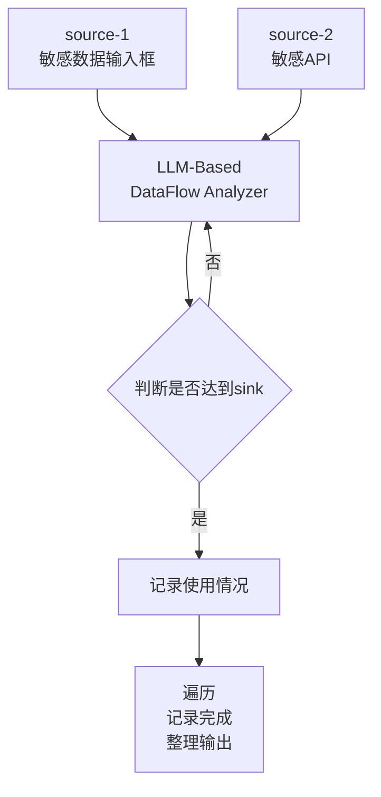

```mermaid
flowchart TD
    A[source-1\n敏感数据输入框] --> B[LLM-Based\nDataFlow Analyzer]
    C[source-2\n敏感API] --> B
    B --> D{判断是否达到sink}
    D -- 否 --> B[LLM-Based\nDataFlow Analyzer]
    D -- 是 --> E[记录使用情况]
    E --> F[遍历\n记录完成\n整理输出]
```